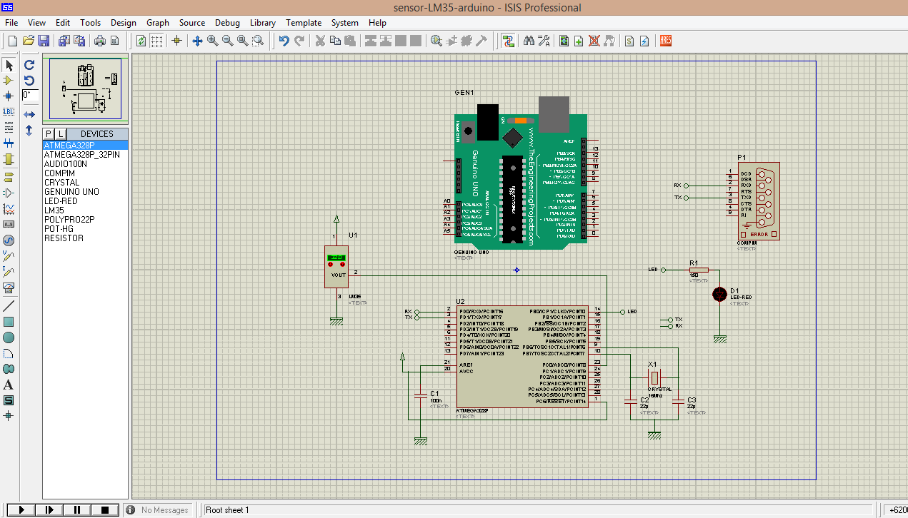
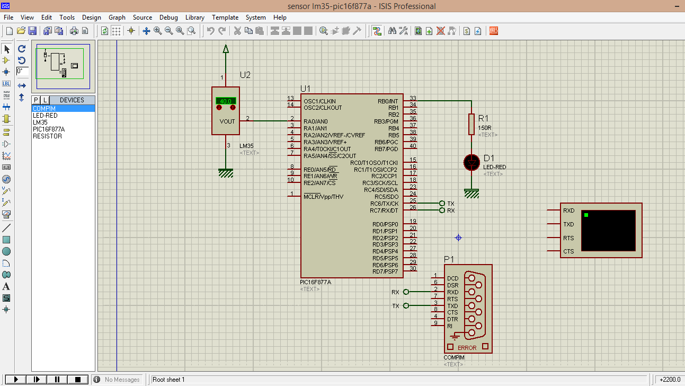
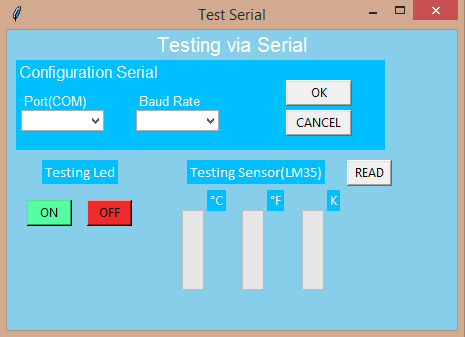

# Serial-Tkinter-Pic-Arduino
 O projeto consiste em utilizar microcontroladores como o **Arduino Uno** e o **PIC16f877a**, para fazer a leitura da temperatura com **sensor LM35**, e também a um exemplo de **blink-led** no circuito. 

Para ver a leitura do sensor(Celsius[°C], Fahrenheit[°F] e Kelvin[K]) e acender/apagar o led , foi feita um dashboard, com a biblioteca de desenvolvimento de interfaces nativa do **Python** a Tkinter, ou seja, não é necessário instala-lá, basta instalar o python na sua máquina.

Para fazer essa transmissão de dados lidos pelo sensor no programa Isis Proteus e ligar/desligar led's, foi utilizado um programa para virtualização de portas seriais. 

Na vida real seria utilizado, o comunicador á cabo RS-232, para fazer a transmissão dos dados entre interface e dispositivos.
 
## Programas Utilizados

* [Arduino](https://www.arduino.cc/)

* [MikroC for PIC](https://www.mikroe.com/mikroc-pic)

* [Isis Proteus para simulação](https://www.labcenter.com/)

* [Visual Studio Code (VSCode)](https://code.visualstudio.com/)  

* [Python](https://www.python.org/)   

## Imagens do Circuito
### Circuito Arduino

### Circuito PIC

### Interface Python(Tkinter)

